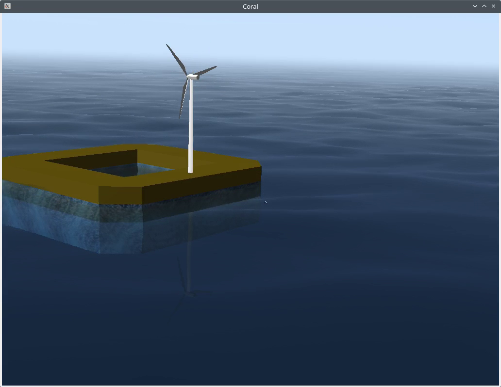

# Coral - osgOcean-based viewer for ROS 2

This ROS 2 package allows displaying simulated scenes with osgOcean. It is inspired from the well-known UWSim in ROS 1.

Contrary to UWSim, Coral is not a simulator at all and only renders available models found on the TF tree. It is compatible with Gazebo simulation, if the poses of the objects are published and bridged to ROS.



 - Coral can detect `robot_description` topics and will then monitor the poses of the discovered frames through `/tf`
 - a special frame is `coral_cam_view`: if available in the TF tree then Coral will use this frame to place its camera. If the frame is not refreshed for 1 sec then the camera will be free-flying again

 `coral_gui` is the main node and has parameters to tune the scene rendering: wind, waves and foam, initial camera position, water surface reflection and refraction, or toggle glare or godrays.

 - one parameter is `spawn_auto` (default 2): the delay before Coral tries to spawn all available `robot_description`. Set to 0 to deactivate this feature.

## Spawning a robot

`coral_gui` provides the `/coral/spawn` service defined as:

```
string robot_namespace
string pose_topic "pose_gt"
string world_model
---
```

 - If `world_model` is defined, it should be the path to some URDF file where `world` is the root frame (typically a world mesh).
Otherwise, will use the `robot_namespace` to listen for a `robot_description` topic and spawn the corresponding robot.
- If `pose_topic` is defined (and carries `geometry_msgs/Pose` msgs, Coral will use it to update the pose of the root frame of the robot. Otherwise, it will rely on `/tf`.

Note that Coral will always rely on `/tf` to get the relative pose of the links that belong to a given robot (typically published by `robot_state_publisher`). Only the root link can be chosen as being updated either from a topic, or from `/tf`.

If both `world_model` and `robot_namespace` are empty (default) then Coral will poll all current `robot_description` topics.

 - if any was not parsed yet, it will add the corresponding model
 - if a topic in the same namespace is carrying `geometry_msgs/Pose` data, Coral will assume it is the ground truth for this model

The `spawn` executable is a wrapper around the `Spawn` service that is used to add a new model in the simulation. Available if `simple_launch` is installed.
When run without parameters, will have Coral spawn all available `robot_description`.

## Controlling the point of view

A helper launch file is `track_launch.py` and simply publishes a static transform between the given `link` and the `coral_cam_node` link, in order to automatically track the corresponding link inside Coral. The `simple_launch` and `slider_publisher` packages are required to tune the view point:

```
sudo apt install ros-${ROS_DISTRO}-slider-publisher ros-${ROS_DISTRO}-simple-launch
```

## Spawning a marker

`coral_gui` provides the `/coral/marker` service defined as:

```
# topic to subscribe for this marker
string topic

# RGB color of the marker
float64[3] rgb

# Message type, empty to delete the marker on this topic
string message
```

For now `geometry_msgs/Pose`, `geometry_msgs/PoseStamped` and `nav_msgs/Path` are supported.
The `marker` executable is a wrapper around the `Marker` service. Available if `simple_launch` is installed.
